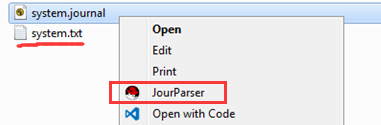

# This is a easy journal log parser tool
#### Usage Steps:
1. Config the `configure.json` before your first using
    * `remote_path`: give a your journal folder on 33. eg: mine is `/root/usr/journal/chrhong/`
    * `context_menu`: must be `"disable"` before your first using 
2. Run `JourParser.exe` as administrator first time.
3. Then you can find a `"JourParser"` item in your contextmenu, click it and you can get a result in the same folder.

4. Enjoy it.

#### **Note and Warnings !**
1. `remote_path` should be paticularly created and only used to put journal file. Because the tool will clean up the folder every time.
Suggestion is to create your folder here: `/root/usr/journal/yourName/`

2. `context_menu` once `enable`, mean you already add the `JourParser` to your contextmenu, if you move the `JourParser.exe` to another place, you need to run `"Usage Step1 and Step2"` as above again.
